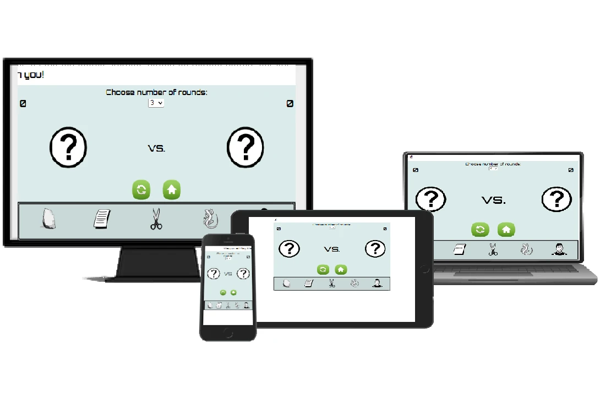
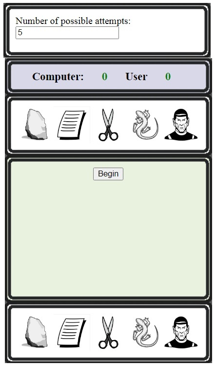
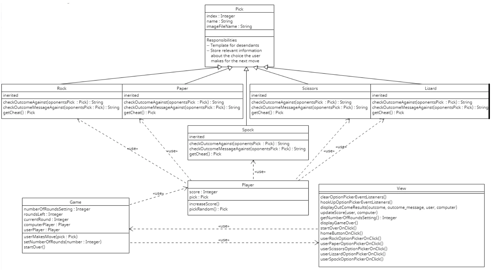
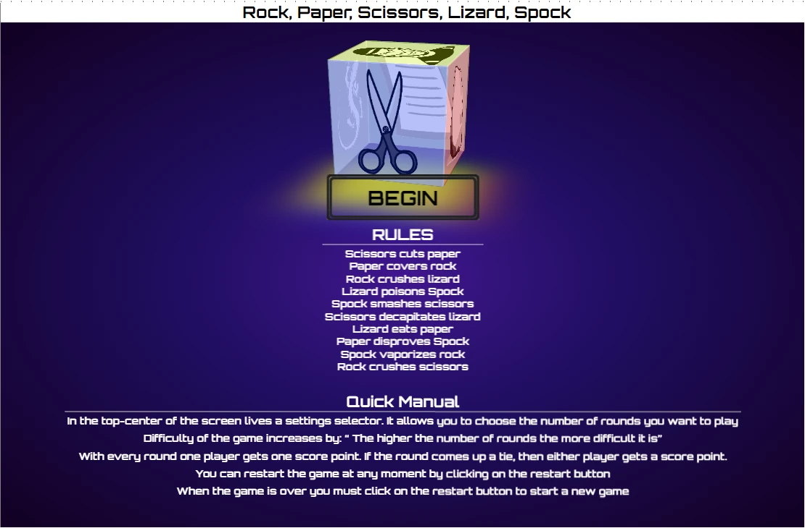
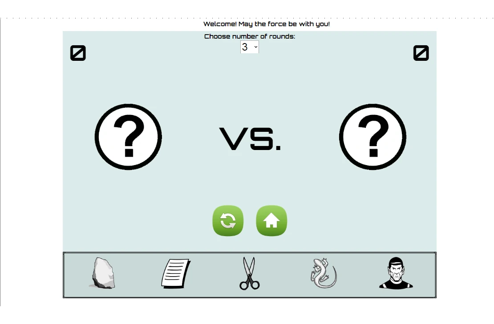
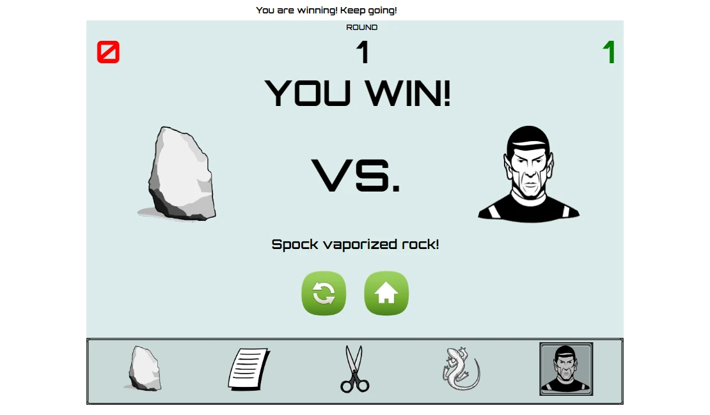
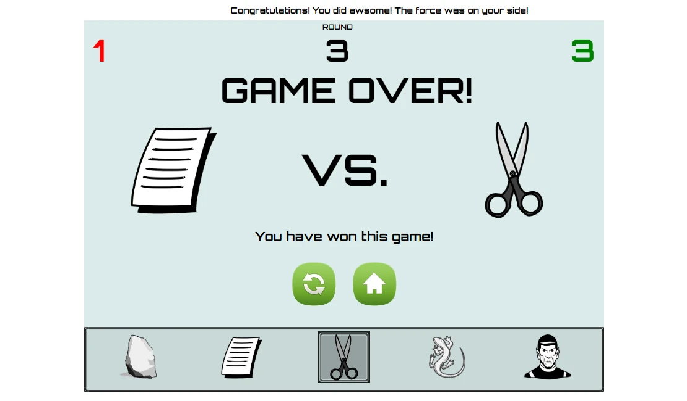
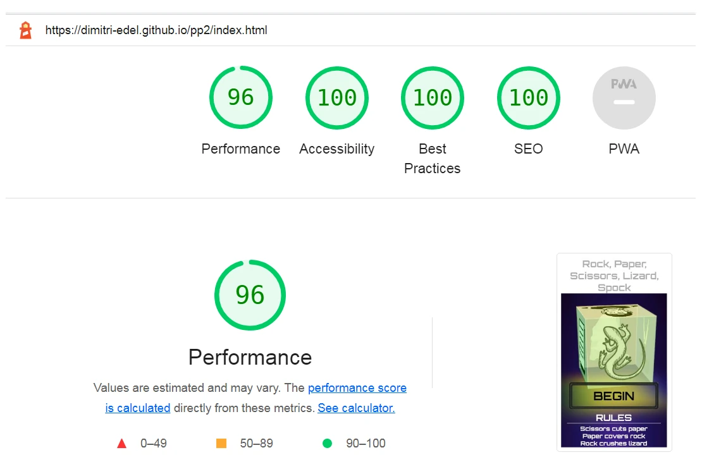
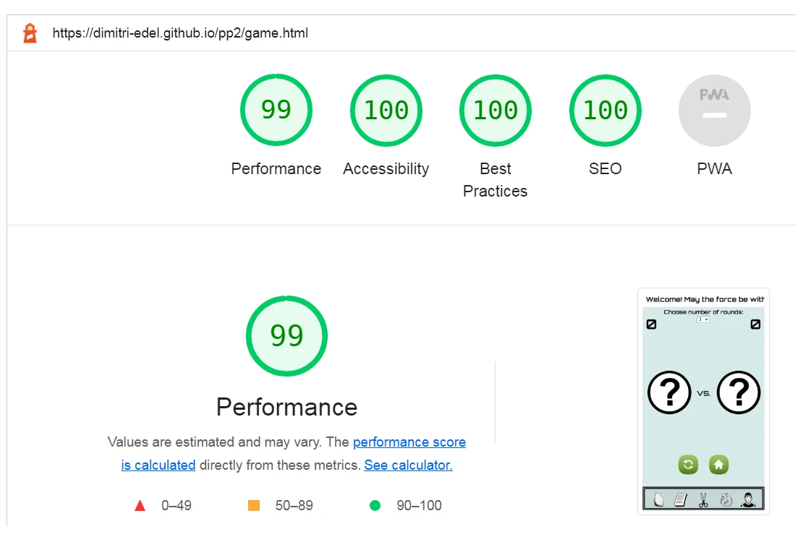

# Rock, Paper, Scissors, Lizard, Spock
## Preparation
I began with implementing the game logic using JavaScript. Then proceeded to designing the view elements.
 
### ISSUES
#### PRESENTATION DESIGN
The **first design** was **not user friendly** and the mentor did not aprove. He said it was 'not nice', even thourgh I am sure he had a very different word in mind. Here is a picture of how it looked at first

So I changed it to the one you will see below. This one the mentor loved. And not only was it more user friendly but also more developer friendly.

#### MEDIA RESPONSIVE DESIGN
I have tried to cover all the devices that Chrome's dev tools had to offer. Since I am on the fast track schedule there simply was not enough time to cover them all **perfectly**. So I implemented a few generic queries that cover a range of devices. The method is to divy up the devices into groups of simple dimensions. Then simply use the group's minimum required width and the minimum required height for dimensions. 
I attempted to use percentages for the layout, but it left much to be desired. Especialy sizing the images was a real problem, so I guess I still have a lot to learn. For the time being it is best to stick with what I have learned so far. Thus I hard coded the sizes in pixels. Percentages only came in handy with a few elements. 
A few devices that have a width of less than 320 pixels have not been covered.

### OBJECT ORIENTED DESIGN FOR JAVASCRIPT
Since JavaScript provides the means for an Object Oriented Design, I decided to take advantage of that. This aproach simplifies everything by making things easier to oversee. I decided to make a class that represents the choice that the user makes. For there are five different characters that the user can choose to play, there will be one general Class ,which I named Pick. And then five classes that inherit from it, namely Rock, Paper, Scissors, Lizard and Spock.
Also, I need to separate the presentation from the game logic. Hence, I created a Game class and a View class. The View class contains all the event-handlers that are triggered when the user clicks on a responsive element, like a button. The event-handlers in the View will in turn trigger the corresponding method in the Game object. Upon which the Game object will report back to the view object and , so to speak, ask it to apply some changes to either HTML or CSS. There is also a class named Player which is used by the Game class to create two players: one for the computer and one for the user of the page. 

Below you can see a simplified Class Diagram

#### Simplified Class Diagram

### GOAL
The basic idea is to build a Rock, Paper, Scissors, Lizard, Spock Game
#### External user’s goal
The site’s users want to play an online game that has elements of chance.
#### Site owner's goal:
The site’s goal is to provide a challenging game with increasing levels of difficulty to entertain online users.
#### Potential features to include:
- Pattern matching functionality
- A limited number of tries before the game is over
- A score tracking system
- The ability to play against the computer
### IMAGES
All the images were free and I gathered them from various providers, whose names are listed in credits. Only two of the images I drew myself, because it was simple. I drew the paper sheet icon and the home icon. I downloaded the restart icon from freeiconspng.com and then used it as a template for the home button.
### LAYOUT

#### HOME PAGE
Home page contains the begin-button that takes the user to the game page.
It also has a list of rules to the game. Furthermore, it has a quick manual that explains a few things you might need to know before playing the game.

#### GAME PAGE
#### Before the game begins

#### Settings

Before the game begins, user has the option to choose the number of rounds to play. 
#### Rounds

When the user plays the next round, by picking a character that they want to play. If they win the round, several things are going to happen:
1) The user score, which sits in the top right corner, will get updated. 
2) The image of the character that the user picked will appear on the right hand side, replacing whatever image used to be there.
3) The image of the character that the computer picked will appear on the left hand side, replacing whatever image used to be there.
4) The user can see the message that states that they win.
5) The user can see the message that explains why they win, by reciting one of the rules.
6) The text that appears at the very top of the page gets updated to one of the motivational phrases. This text is always moving from left to right.

#### Game over

Once the game is over, this is what the user is going to see:
1) The final score.
2) Images of the characters that were played in the last round.
3) The 'GAME OVER' message.
4) The message that states the outcome of the game.

At this point the user has the option of restarting the game or going back to the home page.
## Features
The user can choose how many attempts they want to play per game. Which I refer to as 'rounds'.
The level of difficulty increases,depending on the number of rounds they choose to play. Yet the initial setting of three lets the computer pick randomly. Otherwise the computer will cheat ever so often.

### NAVIGATION
The index page has the begin button, that takes the user to the game page.
On the game panel lives a home button that takes the user back to the home page.

## Responsive Design
I have covered most of the devices that the dev tools provided dimensions for. Only few of them have not been covered so far, but will be as soon as I get around to doing it.
## Testing
### LIGHTHOUSE
I guess it's just like they say: 'A picture is worth a thousand words!'
#### home page

#### gmae page

### BUGS
#### JavaScipt
There was a typo, that was causing problems. I misspelled the word lizard. There was and still is an arry by the name 'LIZARD' and a class with the name 'Lizard'. However the name of the class was spelled incorrectly like so 'Lizzard'. One of the tag id's in html alos used the incorrect spelling. I used the debugger and the culprits were found out rather quickly. I rectified the spelling in the class name and the html-tag-id and it fixed everything.
#### CSS
After I added some comments to the game.css file, there was an error. I forgot one of the curly braces, so the media query was off. 

### VALIDATOR TESTING
The pages have been tested by validator.w3.org and jigsaw.w3.org/css-validator and have passed the tests.
### JSHint 
The JavaScript has been tested in JSHint without any issues as long as it is set to esversion: 6. Otherwise, it will show some warnings because I use ECMAScript 6 features such as const and let instead of the var keyword. Consequently, this JScript will not work on devices that came out before 2015 and have not been properly updated. 
P.S. I use const for values that are constant, even though the keyword is used for 
declaring a variable. However, it is just my personal preference.
## Deployment
The site has been deployed from GitHub Pages. The way to do that was to go to the settings. Click on the Pages icon. Select the repository and the branch. And click on Publish. And that was that.
## Technologies
- GitHub
- GitPod
- Gimp wsa used to manipulate images
- Chhrome Developer Tools for testing and debugging

## Credits
### HTML & CSS Coding
- w3schools as a tutorial for more sophisticated HTML & CSS
- Code Institute tutorials for Basic HTML & CSS 
- YouTube : Ambient Light Effects | CSS 3D Glowing Cube Animation Effects
- YouTube : How to make a CSS 3D Cube Animation with HTML and CSS

### JavaScript Coding
- Code Institute tutorials for Basic JavaScript
- w3schools as a tutorial on OOD JavaScript
- Stackoverflow.com for some advanced tecchniques in JavaScript

### MEDIA
- restart icon - free icons png
- vector portal (image of spock)
- cliparting.com (image of rock)
- NicePNG (image of scissors)
- 123RF (image of lizard)

### DESIGN
Special thanks to my mentor Adegbenga Adeye for providing many useful tips on the design.
